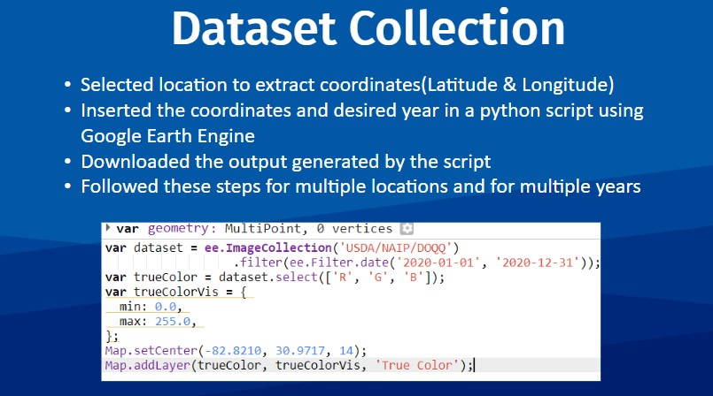
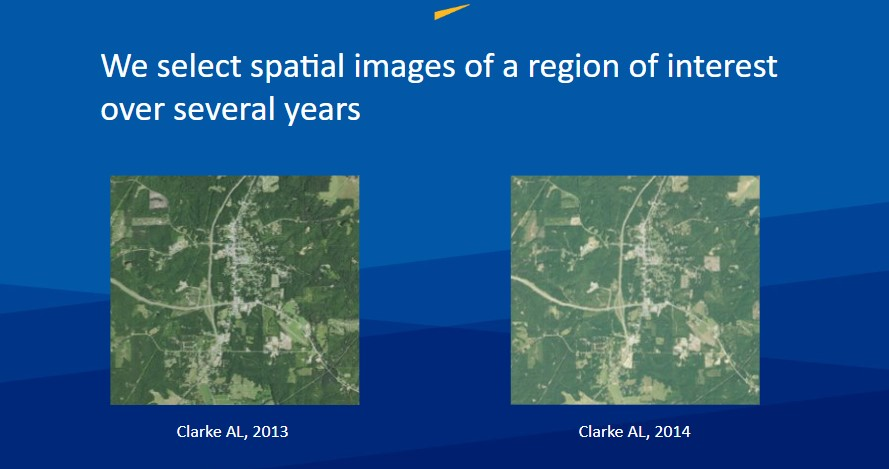
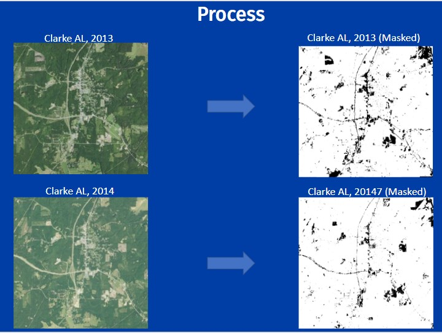
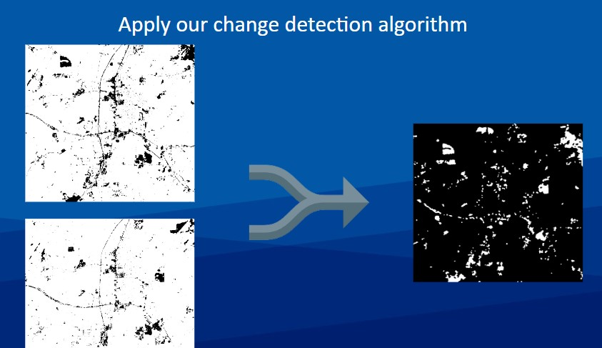
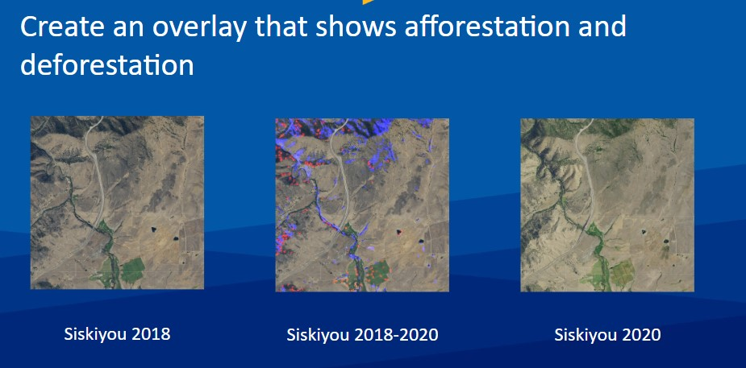
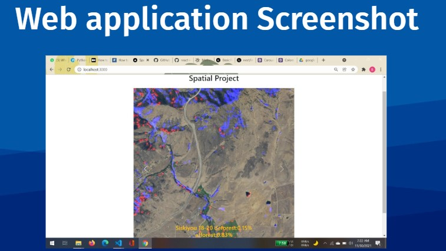

# Temporal afforestation and deforestation geo change detection in satellite images
## About <a name = "about"></a>

We aim to develop an algorithm that shows the percentage change of forest cover in terms of afforestation and deforestation over any two given periods of time over a specified area. (Python, Next JS, OpenCV, image processing, machine learning)

Frontend Web app made with NextJS framework and backend with python.

Used KMeans, PCA, OpenCV to extract features display them.


## Output <a name = "Output"></a>

### Data Collection


### Working and Web App







## Getting Started <a name = "getting_started"></a>

First, run the development server:

```bash
npm run dev
# or
yarn dev
```

Open [http://localhost:3000](http://localhost:3000) with your browser to see the result.

### Prerequisites

What things you need to install the software and how to install them.

```
Give examples
```

### Installing

A step by step series of examples that tell you how to get a development env running.

Say what the step will be

```
Give the example
```

And repeat

```
until finished
```

End with an example of getting some data out of the system or using it for a little demo.